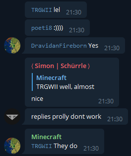

# TeMiCross

This is a Minecraft-to-Telegram chat bridge

## Setup

### Prerequisites

1. Install [Node.js](https://nodejs.org/)
1. Install temicross: `npm i -g temicross`

### Easy mode (bot + minecraft server)

1. [Download the Minecraft server jar](https://minecraft.net/download/server) and put it in a folder if you haven't.
1. Open a terminal.
1. `cd` to your Minecraft server folder.
1. Run `tmc botwrap` to set up your server and bot.
	* You will be asked to fill in some values.
	* Get a bot token from [@BotFather](https://t.me/BotFather).
1. The server and bot will start.
1. Test it in-game and from your Telegram-chat to make sure it works!
1. Report any bugs you find on the Issues page here!

### Unattended mode

This mode enables updating the bot without restarting the Minecraft server.

#### Setup server

1. Follow steps 1-3 from [above](#easy-mode-bot-+-minecraft-server).
1. Run `tmc wrap` to start the server.
	* You will be asked to fill in some values.
1. The server will start.

#### Setup bot

1. Open a new terminal and `cd` to any folder (Your bot config will be stored here, if you don't know which folder to pick, the same folder as [above](#easy-mode-bot-+-minecraft-server) is a good choice).
1. Run `tmc bot` (make sure the Minecraft server is started using `tmc wrap` first, see [above](#setup-server)).
	* You will be asked to fill in some more values.
	* Use the token you got from [@BotFather](https://t.me/BotFather).
	* Make sure to use the same port and IP as you did before (the defaults are the same).
1. The bot will start.

#### Setup client

The client allows remote control of a server that has been properly set up with port and IP.

**MAKE SURE YOU KNOW THE SECURITY IMPLICATIONS OF ALLOWING REMOTE UNAUTHENTICATED ACCESS TO YOUR SERVER CONSOLE**

1. Open a new terminal and `cd` to any folder (your client config will be stored here)
1. Run `tmc client` (make sure the Minecraft server is started using `tmc wrap` first, see [above](#setup-server)).
	* You will be asked to fill in even more values.
1. The client will start, and you can type commands into it to run commands on the server console.
